  

  

  

 

<strong>AQUA LAUNCH</strong> · animated profile system · powered by live GitHub data

---

### About

Computer Engineering student and backend developer focused on Python and Django.
I build and run production web applications end to end — business logic, REST APIs,
database design, then deployment and maintenance on Linux VPS with Nginx and Gunicorn.

- Backend architecture, authentication, OTP and notification systems
- MySQL design and query optimization
- Linux server administration, deployment, logging and monitoring
- Web security hardening and performance optimization

### Stack

 

### Featured project — [Mah Auction](https://mahauction.com)

A live online platform for art auctions and art sales, built and operated end to end.

| Area | What I built |
| --- | --- |
| Auctions | Bidding system, bid validation, auction lifecycle, winner management |
| Accounts | Authentication, email and mobile verification, OTP, credit management |
| Store & gallery | Artwork and product management, admin panel |
| Notifications | Email and SMS integration, notification architecture |
| Infrastructure | Linux VPS, Nginx, Gunicorn, production deployment, logging, monitoring |
| Data | MySQL schema design, query optimization, data management |

`Python` · `Django` · `MySQL` · `HTML` · `CSS` · `JavaScript` · `Tailwind CSS` · `Linux` · `Nginx` · `Gunicorn` · `Git`

### Currently learning

Advanced Django · backend architecture · REST API design · database optimization ·
Linux administration · DevOps and deployment · web security · scalable web applications

---

Built with the Aqua Launch profile system — see <a href="./SETUP.md">SETUP.md</a>.

